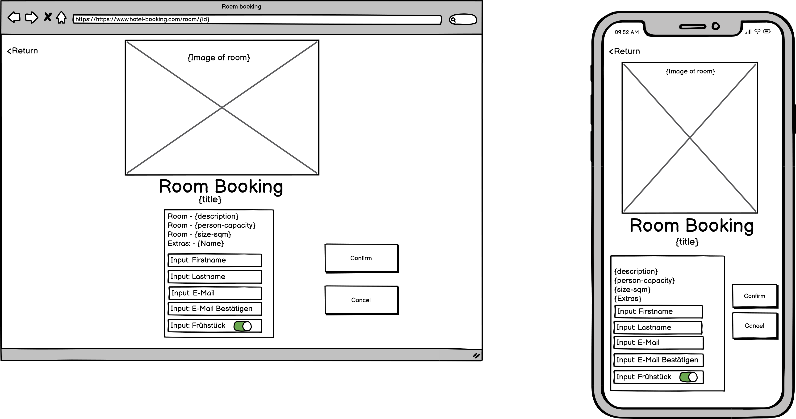

# Paperprototype  

This is only a draft that may change in the future.  
  
The components that could be used per page can be found below the image.
  

  
# Landingpage

Ioniq Components:
- `<ion-header>`  
Header is a root component of a page that aligns itself to the top of the page. 
Maybe for our title?
- `<ion-footer>`  
Footer is a root component of a page that aligns itself to the bottom of the page.
- `<ion-toolbar>`  
Toolbars are generally positioned above or below content and provide content and actions for the current screen. When placed within the content, toolbars will scroll with the content. Toolbars can contain several different components including titles, buttons, icons, back buttons, menu buttons, searchbars, segments, progress bars, and more.
- `<ion-button>`  
The Buttons component is a container element. It should be used inside of a toolbar and can contain several types of buttons, including standard buttons, menu buttons, and back buttons.
- `<ion-datetime-button>`  
Datetime Button links with a Datetime component to display the formatted date and time. It also provides buttons to present the datetime in a modal, popover, and more.
- `<ion-select :multiple="true">`  
Selects are form controls to select an option, or options, from a set of options. When a user taps the select, a dialog appears with all of the options in a large, easy to select list. By adding the multiple attribute to select, users are able to select multiple options.
- `<ion-list>`  
Lists are made up of multiple rows of items which can contain text, buttons, toggles, icons, thumbnails, and much more. Lists generally contain items with similar data content, such as images and text.
- `<ion-router>`  
Apps should have a single ion-router component in the codebase. This component controls all interactions with the browser history and it aggregates updates through an event system.
- `<ion-tabs>`  
Tabs are a top level navigation component to implement a tab-based navigation. The component is a container of individual Tab components. Tabs can be used with the Ionic router to implement tab-based navigation.

Optional:
- `<ion-breadcrumbs>`  
Breadcrumbs are navigation items that are used to indicate where a user is on an app or site.

      

# Room Booking Page

- `<ion-header>`    
Header is a root component of a page that aligns itself to the top of the page. 
Maybe for our title?
- `<ion-footer>`    
Footer is a root component of a page that aligns itself to the bottom of the page.
- `<ion-toolbar>`  
Toolbars are generally positioned above or below content and provide content and actions for the current screen. When placed within the content, toolbars will scroll with the content. Toolbars can contain several different components including titles, buttons, icons, back buttons, menu buttons, searchbars, segments, progress bars, and more.
- `<ion-grid>`    
The grid is a powerful mobile-first flexbox system for building custom layouts. It is composed of three units — a grid, row(s) and column(s).
- `<ion-toggle>`
Toggles are switches that change the state of a single option. They can be switched on or off by pressing or swiping them. Toggles can also be checked programmatically by setting the checked property.
- `<ion-tabs>`  
Tabs are a top level navigation component to implement a tab-based navigation. The component is a container of individual Tab components. Tabs can be used with the Ionic router to implement tab-based navigation.

      

# Administration Page

- `<ion-header>`  
Header is a root component of a page that aligns itself to the top of the page. 
Maybe for our title?
- `<ion-footer>`  
Footer is a root component of a page that aligns itself to the bottom of the page.
- `<ion-toolbar>`  
Toolbars are generally positioned above or below content and provide content and actions for the current screen. When placed within the content, toolbars will scroll with the content. Toolbars can contain several different components including titles, buttons, icons, back buttons, menu buttons, searchbars, segments, progress bars, and more.
- `<ion-button>`  
The Buttons component is a container element. It should be used inside of a toolbar and can contain several types of buttons, including standard buttons, menu buttons, and back buttons.
- `<ion-list>`  
Lists are made up of multiple rows of items which can contain text, buttons, toggles, icons, thumbnails, and much more. Lists generally contain items with similar data content, such as images and text.
- `<ion-tabs>`  
Tabs are a top level navigation component to implement a tab-based navigation. The component is a container of individual Tab components. Tabs can be used with the Ionic router to implement tab-based navigation.   
  
Optional:
No prebuilt Pagination Component from Ionic available, build custom pagination.